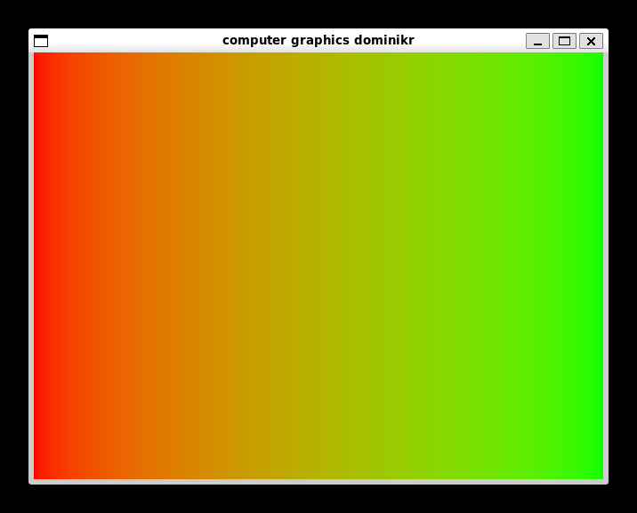
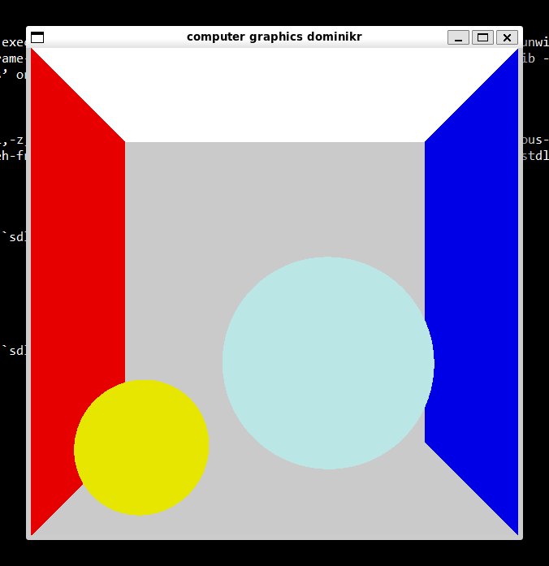
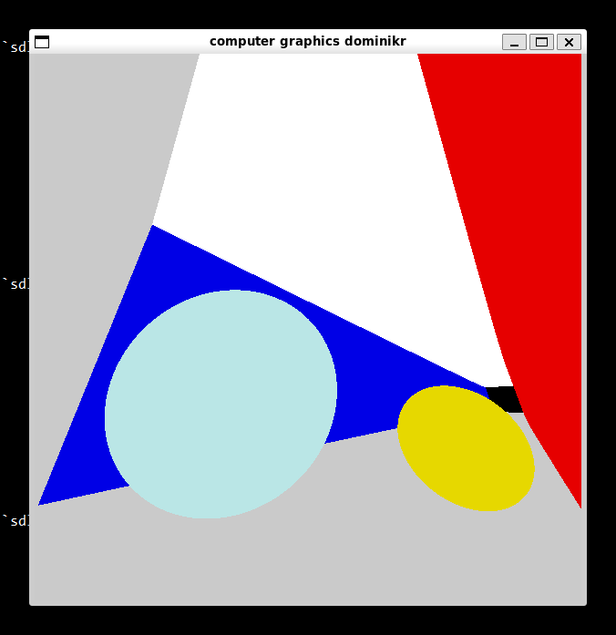

Code for the computer graphics course HS26, by dominikr

Written in C and SDL2. Should also work with the `sdl2-compat` layer.

## Build
`make`

## LLM prompts used
The search term `SDL_MUSTLOCK` was typed into the Google search engine,
and 6 lines generated by the Google "AI Overview" were used in the code.

## Screenshots
### Week 1

### Week 2

