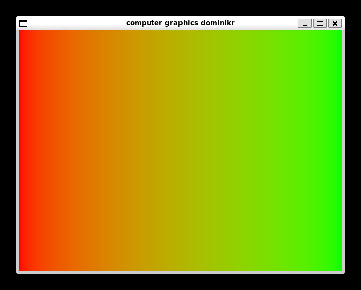
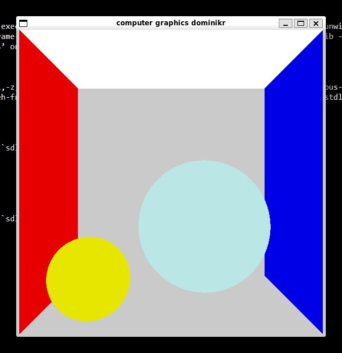
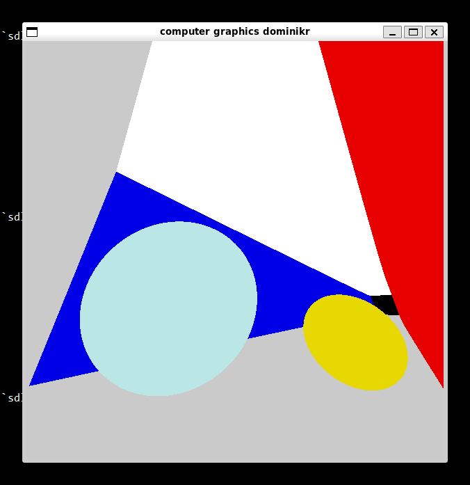

Code for the computer graphics course HS26, by dominikr

Written in C/C++ and SDL2. Also works with the `sdl2-compat` layer.

## Build
`make`

## alternative graphical frontend
There's an alternative frontend using the linux framebuffer device (`/dev/fb0`),
and without using any libraries (compiled using `-ffreestanding`).

All the files related to that are in the separate `fbdev` directory. All the code
was written by me, over the course of the last few years. It is not part of my
graded submission.

## LLM prompts used
The search term `SDL_MUSTLOCK` was typed into the Google search engine,
and 6 lines generated by the Google "AI Overview" were used in the code.

The following prompt was used with Google search "AI Mode":
"How do I calculate the cross product in C? I'm using a struct called vec3 that contains 3d points"

## Screenshots
### Week 1

### Week 2

